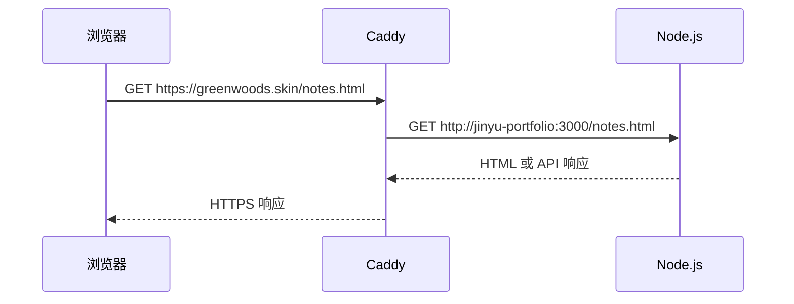

## 目录

1. [Caddy 解决什么问题](#caddy-解决什么问题)
2. [反向代理是什么](#反向代理是什么)
3. [HTTPS 证书原理](#https-证书原理)
4. [我的 Caddy 配置](#我的-caddy-配置)
5. [请求流转过程](#请求流转过程)
6. [部署验证](#部署验证)
7. [常见问题](#常见问题)
8. [Caddy 与 Nginx](#caddy-与-nginx)

## Caddy 解决什么问题

Node.js 可以返回网页，但生产网站还需要一个公网入口来处理：监听 80/443、申请 HTTPS 证书、按域名转发、压缩文本和统一基础网络配置。

Caddy 放在浏览器和 Node.js 之间：

```text
浏览器
  ↓ HTTPS :443
Caddy
  ↓ Docker 内网 HTTP
Node.js :3000
```

## 反向代理是什么

反向代理代表服务器接待客户端。用户只访问 `greenwoods.skin`，不知道 Node.js 容器的内部地址。Caddy 收到请求后，根据域名和规则转发给后端。



这样做的好处是 Node.js 不直接暴露公网，HTTPS 配置集中在 Caddy，多个网站可以共用 80/443 端口。

## HTTPS 证书原理

HTTPS 是 HTTP 加 TLS。TLS 会加密浏览器和服务器之间的内容，并验证域名证书。

Caddy 使用 ACME 协议申请证书：

```text
Caddy 申请证书
  ↓
证书机构验证域名控制权
  ↓ DNS 和 80/443 验证通过
签发证书
  ↓
Caddy 自动续期并加载
```

部署前确认 DNS 指向服务器，云安全组和防火墙放行 80、443，Cloudflare 规则没有阻断验证，Caddyfile 中域名拼写正确。

## 我的 Caddy 配置

```caddyfile
greenwoods.skin {
    encode zstd gzip
    reverse_proxy jinyu-portfolio:3000
}

reading.greenwoods.skin {
    encode zstd gzip
    reverse_proxy greenforest-reading:3000
}
```

`greenwoods.skin { ... }` 表示这一组规则服务于该域名，Caddy 会自动为它管理 HTTPS。

`encode zstd gzip` 对 HTML、CSS、JavaScript 和 JSON 等文本进行压缩。`zstd` 压缩效率较高，`gzip` 兼容性较好。

`reverse_proxy jinyu-portfolio:3000` 表示把请求转发到 Docker 网络中名为 `jinyu-portfolio` 的容器的 3000 端口。

## 请求流转过程

访问笔记页时：

1. 浏览器解析 `greenwoods.skin`。
2. Cloudflare 根据 DNS 找到服务器或代理地址。
3. 请求通过 HTTPS 到达 Caddy 的 443 端口。
4. Caddy 解密 TLS，并按域名匹配站点块。
5. Caddy 通过 Docker 内网请求 Node.js 的 3000 端口。
6. Node.js 返回 `notes.html`。
7. 浏览器 JavaScript 再请求 `/api/notes`。
8. Node.js 读取 Markdown 元数据并返回 JSON。
9. 前端将 JSON 渲染成笔记卡片。

Caddy 不负责项目和笔记业务，它主要负责安全接入、转发和基础网络处理。

## 部署验证

```bash
docker exec caddy caddy validate \
  --config /etc/caddy/Caddyfile
```

配置正确后平滑加载：

```bash
docker exec caddy caddy reload \
  --config /etc/caddy/Caddyfile
```

再检查：

```bash
docker ps
docker logs --tail 100 caddy
curl -I https://greenwoods.skin
curl -I https://reading.greenwoods.skin
```

## 常见问题

### 502 Bad Gateway

通常表示 Caddy 找不到后端。检查 Node.js 容器是否运行、容器名和端口是否正确、两个容器是否在同一个 Docker 网络。

### HTTPS 证书申请失败

检查 DNS、80/443 端口、防火墙和 Cloudflare 代理设置。

### 修改配置不生效

先执行 `caddy validate`，再执行 `caddy reload`，并确认宿主机配置已挂载到 Caddy 容器。

## Caddy 与 Nginx

Caddy 配置短、HTTPS 自动化程度高，适合这个个人网站。Nginx 生态更成熟，在复杂缓存、负载均衡和大型团队运维中更常见。
