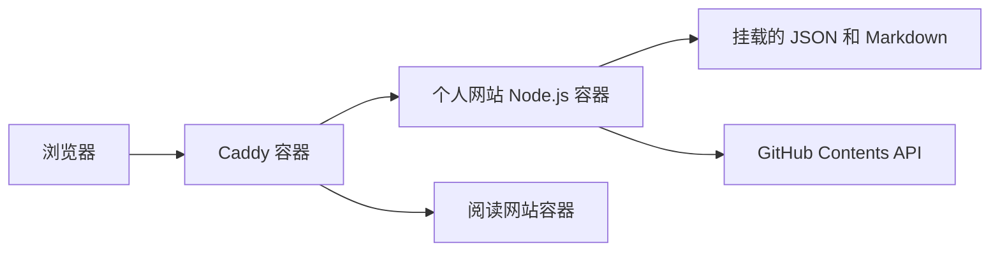

#

> 本文以个人网站案例说明 Docker。示例中的密码、令牌和服务器地址都是占位符，不能把真实密钥写进镜像或 Git。

## 目录

1. [Docker 解决什么问题](#docker-解决什么问题)
2. [核心概念](#核心概念)
3. [本项目的容器架构](#本项目的容器架构)
4. [Dockerfile](#dockerfile)
5. [启动容器](#启动容器)
6. [数据挂载](#数据挂载)
7. [网络与排错](#网络与排错)
8. [安全建议](#安全建议)

## Docker 解决什么问题

直接在服务器安装 Node.js 时，程序依赖服务器上的 Node.js 版本、系统库、目录和环境变量。换服务器后，可能需要重新配置一整套环境。

Docker 把程序和运行环境制作成镜像，再由镜像启动容器：

```text
源代码 + 运行时说明
       ↓ docker build
     镜像 Image
       ↓ docker run
    容器 Container
```

容器不是完整虚拟机。它共享宿主机 Linux 内核，但隔离进程、文件系统和网络，因此启动快、占用资源少。

## 核心概念

| 概念 | 小白理解 | 本项目例子 |
| --- | --- | --- |
| Image 镜像 | 可重复使用的应用模板 | `jinyu-portfolio:latest` |
| Container 容器 | 镜像启动后的运行实例 | `jinyu-portfolio` |
| Dockerfile | 制作镜像的说明书 | 安装 Node.js、复制服务代码 |
| Volume 挂载 | 将服务器目录接入容器 | 保存 Markdown 和 JSON |
| Network 网络 | 容器间的内部通信 | Caddy 访问 Node.js:3000 |

镜像通常是只读的，容器有临时可写层。删除容器后，临时层中的数据可能消失，所以笔记和配置不能只保存于容器内部。

## 本项目的容器架构



两个域名对应两个独立服务：

- `greenwoods.skin` 转发给个人网站容器。
- `reading.greenwoods.skin` 转发给阅读网站容器。
- 两个容器不共享代码和内容目录，降低相互影响。

个人网站的 Node.js 只在容器内监听 `3000`，公网请求由 Caddy 接收后再通过 Docker 网络转发。

## Dockerfile

```dockerfile
FROM node:24-alpine
WORKDIR /app
COPY server.mjs /app/server.mjs
ENV SITE_ROOT=/app/site \
    CONTENT_ROOT=/app/content \
    NODE_ENV=production
CMD ["node", "server.mjs"]
```

- `FROM`：选择带 Node.js 的基础镜像，Alpine 版本较小。
- `WORKDIR`：设置容器内部工作目录。
- `COPY`：复制后端入口文件。
- `ENV`：设置普通运行参数，不要写密码和 Token。
- `CMD`：容器启动时运行 Node.js 服务。

Dockerfile 只是构建说明，执行 `docker build` 后才会产生镜像。

## 启动容器

```bash
cd /opt/greenwoods.skin/app
docker build -t jinyu-portfolio:latest .
```

```bash
docker run -d \
  --name jinyu-portfolio \
  --restart unless-stopped \
  --env-file /opt/greenwoods.skin/secrets/portfolio.env \
  -v /opt/greenwoods.skin/site:/app/site:ro \
  -v /opt/greenwoods.skin/content:/app/content:rw \
  --network proxy \
  jinyu-portfolio:latest
```

参数含义：

- `-d`：后台运行。
- `--restart unless-stopped`：服务器重启后自动恢复。
- `--env-file`：读取私有环境变量。
- `:ro`：页面代码只读挂载。
- `:rw`：内容目录允许后台写入。
- `--network proxy`：加入 Caddy 所在的 Docker 网络。

## 数据挂载

推荐的服务器目录如下：

```text
/opt/greenwoods.skin/
├── app/       # Dockerfile、server.mjs
├── site/      # HTML、CSS、前端 JS
├── content/   # projects.json、notes/*.md
└── secrets/   # 仅 root 可读的环境变量
```

重新构建容器时，`app` 可以更新，`content` 不会因为容器删除而丢失。后台保存的内容还会同步到 GitHub，形成额外版本备份。

## 网络与排错

同一个 Docker 网络中的服务可以用容器名通信：

```text
Caddy ──HTTP──> jinyu-portfolio:3000
```

常用命令：

```bash
docker ps
docker ps -a
docker logs --tail 100 jinyu-portfolio
docker logs -f jinyu-portfolio
docker inspect jinyu-portfolio
docker exec -it jinyu-portfolio sh
```

常见错误：

- 容器立即退出：Node.js 启动报错或缺少环境变量。
- Caddy 返回 502：后端未运行、端口错误或不在同一网络。
- 内容更新后丢失：`content` 没有正确挂载。
- 修改代码不生效：仍在运行旧镜像，需要重新创建容器。

## 安全建议

- 不要把 `GITHUB_TOKEN` 写入 Dockerfile、前端代码或镜像层。
- 私有环境文件设置为 `chmod 600`。
- 只暴露 Caddy 的 80/443 端口，不要直接暴露 Node.js 3000 端口。
- 定期备份 `content` 和 `secrets`，并测试恢复流程。
- 定期更新基础镜像，删除不用的旧镜像。
