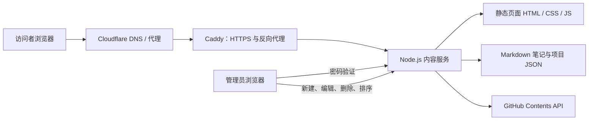

# 个人网站部署实践

# 从零搭建可管理的个人网站：新手实践手册

这是一份基于本项目技术方案整理的实战文档。完成后，你会拥有：

- 一个 HTTPS 个人网站；
- 项目与笔记展示页；
- 一个需要密码验证的内容后台；
- 笔记以 Markdown 保存；
- 后台保存后自动同步到 GitHub；
- 可在后台调整项目和笔记的前台顺序。

> [!IMPORTANT]
> 文中的域名、服务器 IP、密码和令牌均为占位符。不要把真实密码或
> GitHub Token 提交到仓库、放到前端代码，或分享在公开场所。

## 目录

1. [最终架构](#最终架构)
2. [需要准备什么](#需要准备什么)
3. [本项目使用的技术](#本项目使用的技术)
4. [第一步：准备域名与服务器](#第一步准备域名与服务器)
5. [第二步：准备网站代码](#第二步准备网站代码)
6. [第三步：使用 Docker 运行动态网站](#第三步使用-docker-运行动态网站)
7. [第四步：使用 Caddy 提供 HTTPS](#第四步使用-caddy-提供-https)
8. [第五步：接入 GitHub 内容同步](#第五步接入-github-内容同步)
9. [第六步：使用内容后台](#第六步使用内容后台)
10. [日常更新与部署](#日常更新与部署)
11. [常见问题排查](#常见问题排查)
12. [安全清单](#安全清单)

## 最终架构



网站分为两部分：

| 部分 | 作用 | 访问者 |
| --- | --- | --- |
| 前台 | 展示个人介绍、项目和笔记 | 所有人 |
| 后台 | 编辑项目、笔记和展示顺序 | 只有管理员 |

前台页面是静态 HTML、CSS 和 JavaScript；但项目和笔记从 Node.js API
读取，因此它是“静态界面 + 动态内容”的轻量动态网站。

## 需要准备什么

- 一台 Linux 服务器，建议 Ubuntu 或 Debian；
- 一个域名，例如 `your-domain.com`；
- 一个 GitHub 账号与仓库；
- 本机安装 Git；
- 服务器安装 Docker；
- 可通过 SSH 登录服务器。

建议的最低服务器规格：1 核 CPU、1 GB 内存、20 GB 磁盘。这个网站本身
很轻，通常占用几十到一两百 MB 内存，主要取决于 Node.js 与 Docker。

## 本项目使用的技术

| 技术 | 在项目中的用途 | 新手需要理解的点 |
| --- | --- | --- |
| HTML / CSS | 前台、后台的页面和视觉样式 | 浏览器直接展示的内容 |
| 原生 JavaScript | 调用 API、渲染卡片、登录、排序 | 不依赖 React 或 Vue，也能做动态页面 |
| Node.js | 后端 API 与身份验证 | 负责读取/保存内容，绝不把令牌发给浏览器 |
| Markdown | 保存笔记正文 | 便于 GitHub 浏览、版本管理和迁移 |
| JSON | 保存项目资料和笔记排序 | 结构简单，适合小型个人站 |
| Docker | 封装 Node.js 服务 | 服务器更新更稳定、环境一致 |
| Caddy | HTTPS、证书、反向代理 | 自动申请和续期 HTTPS 证书 |
| Cloudflare | DNS 与代理 | 将域名解析到服务器，并提供基础防护 |
| GitHub API | 后台内容同步 | 每次保存生成 GitHub 内容提交 |
| Git / GitHub | 管理网站代码的版本 | 每个功能使用独立、清晰的提交 |

## 第一步：准备域名与服务器

### 1. 配置 DNS

在 Cloudflare 的 DNS 页面添加一条 A 记录：

| 字段 | 示例 |
| --- | --- |
| Type | `A` |
| Name | `@` |
| Content | 你的服务器公网 IP |
| Proxy status | 可先关闭，证书成功后再按需要开启 |

如果有阅读站等独立网站，添加子域名记录，例如：

| Name | 指向 |
| --- | --- |
| `reading` | 同一台服务器公网 IP |

等待 DNS 生效后，在本机检查：

```powershell
Resolve-DnsName your-domain.com
```

### 2. 连接服务器

```bash
ssh root@YOUR_SERVER_IP
```

首次登录后，建议创建普通管理员账号、关闭密码登录并改用 SSH Key。新手阶段
可以先完成部署，但不要长期只依赖 root 密码。

### 3. 安装 Docker

Ubuntu/Debian 示例：

```bash
apt update
apt install -y docker.io docker-compose-plugin
systemctl enable --now docker
docker --version
```

## 第二步：准备网站代码

推荐目录结构：

```text
portfolio/
├── index.html                 # 首页
├── projects.html              # 项目页
├── notes.html                 # 笔记页
├── note.html                  # 单篇笔记页
├── admin.html                 # 登录页
├── dashboard.html             # 内容后台
├── admin.js / admin.css        # 后台逻辑与样式
├── content.js                 # 前台项目、笔记加载逻辑
├── assets/site.css            # 前台样式
├── content/
│   ├── projects.json          # 项目数据
│   ├── notes/*.md             # Markdown 笔记
│   └── notes-order.json       # 笔记前台排序
├── server.mjs                 # Node.js 后端
└── Dockerfile                 # 容器构建说明
```

### 项目数据示例

`content/projects.json` 是一个 JSON 数组。数组中的先后顺序就是前台展示顺序：

```json
[
  {
    "id": "project-id",
    "title": "个人网站内容后台",
    "url": "https://github.com/your-account/your-project",
    "summary": "支持项目、笔记与展示顺序的管理。",
    "tags": ["Node.js", "Docker", "Caddy"]
  }
]
```

### 笔记示例

每篇笔记都是 `content/notes/your-note.md`：

```markdown
---
title: 我的第一篇部署笔记
date: 2026-01-01
summary: 记录个人网站从域名到 HTTPS 的部署过程。
tags: Docker,Caddy,Cloudflare
draft: false
---

# 我的第一篇部署笔记

这里开始写 Markdown 正文。
```

`draft: true` 表示只在后台可见，不会显示在前台。

## 第三步：使用 Docker 运行动态网站

`Dockerfile` 的职责是把后端打包成可运行容器：

```dockerfile
FROM node:24-alpine
WORKDIR /app
COPY server.mjs /app/server.mjs
ENV SITE_ROOT=/app/site \
    CONTENT_ROOT=/app/content \
    NODE_ENV=production
CMD ["node", "server.mjs"]
```

服务器上建议将“程序、静态页面、内容、秘密”分开保存：

```text
/opt/your-site/
├── app/       # Dockerfile、server.mjs
├── site/      # HTML、CSS、JS
├── content/   # projects.json、notes/*.md
└── secrets/   # 仅 root 可读的环境变量文件
```

这种分法的好处是：重新构建容器不会丢失笔记与项目数据。

### 私有环境变量

创建 `/opt/your-site/secrets/portfolio.env`：

```dotenv
ADMIN_PASSWORD=请设置一串长密码
SESSION_SECRET=请设置一串随机字符串
GITHUB_TOKEN=github_pat_替换为你的令牌
GITHUB_REPOSITORY=your-account/your-repository
GITHUB_BRANCH=main
```

限制权限：

```bash
chmod 600 /opt/your-site/secrets/portfolio.env
```

> [!WARNING]
> 不要把这个文件加入 Git；不要把真实令牌写进 `server.mjs`、HTML 或截图。

### 构建和启动容器

```bash
docker build -t your-portfolio:latest /opt/your-site/app

docker run -d \
  --name your-portfolio \
  --restart unless-stopped \
  --env-file /opt/your-site/secrets/portfolio.env \
  -v /opt/your-site/content:/app/content:rw \
  -v /opt/your-site/site:/app/site:ro \
  --network your-proxy-network \
  your-portfolio:latest
```

检查容器：

```bash
docker ps
docker logs --tail 50 your-portfolio
```

## 第四步：使用 Caddy 提供 HTTPS

Caddy 接收公网的 80/443 请求，并转发给 Docker 网络内的 Node.js 容器。

`Caddyfile` 示例：

```caddy
your-domain.com {
    encode zstd gzip
    reverse_proxy your-portfolio:3000
}
```

如果 DNS 正确、服务器开放了 80 和 443 端口，Caddy 会自动申请 HTTPS 证书。

修改配置后，先验证再重载：

```bash
docker exec your-caddy caddy validate --config /etc/caddy/Caddyfile
docker exec your-caddy caddy reload --config /etc/caddy/Caddyfile
```

在浏览器访问：

```text
https://your-domain.com
https://your-domain.com/admin.html
```

## 第五步：接入 GitHub 内容同步

后台保存时，服务器会调用 GitHub Contents API：

1. 读取 GitHub 上文件当前的 SHA；
2. 使用令牌更新项目 JSON 或笔记 Markdown；
3. GitHub 创建内容提交；
4. 服务器同步写入本地 `content/` 目录；
5. 前台下一次读取 API 时看到最新内容。

### 创建正确的 GitHub Token

推荐使用 Fine-grained personal access token：

1. 打开 GitHub Settings → Developer settings → Personal access tokens；
2. 创建 Fine-grained token；
3. Resource owner 选择自己的账号；
4. Repository access 选择需要同步的单个仓库；
5. Repository permissions → **Contents** 设置为 **Read and write**；
6. 将令牌仅保存到服务器私有环境文件。

如果只有 `Read` 权限，后台能读取项目和笔记，但保存时会提示没有内容写入权限。

## 第六步：使用内容后台

访问：

```text
https://your-domain.com/admin.html
```

后台采用“验证页 + 管理页”两页结构：

1. 在验证页输入后台密码；
2. 成功后进入 `dashboard.html`；
3. 在项目或笔记卡片上点击，打开编辑表单；
4. 保存后内容会同步 GitHub；
5. 用卡片下方的 `↑`、`↓` 调整前台顺序。

### 项目管理

可以新建、编辑、删除项目。推荐填写：

- 项目标题；
- 完整链接（必须以 `https://` 或 `http://` 开头）；
- 一两句话的项目简介；
- 用逗号分隔的技术标签。

### 笔记管理

可以新建、编辑、删除笔记。文章标识（slug）推荐使用：

```text
linux-deployment
caddy-notes
my-first-project
```

只使用小写英文、数字和连字符。它会成为笔记 URL 的一部分。

## 日常更新与部署

### 代码更新

建议每个功能使用独立提交：

```bash
git status
git add portfolio/server.mjs
git commit -m "feat: add a new capability"
git push origin main
```

服务器端更新后重新构建容器：

```bash
docker build -t your-portfolio:latest /opt/your-site/app
docker rm -f your-portfolio
# 使用前面同一条 docker run 命令重新启动
```

### 内容更新

日常写项目和笔记不需要 SSH。使用后台保存即可。后台会自动创建 GitHub
内容提交，并让前台 API 立即读取本地最新内容。

## 常见问题排查

### 1. 点击后台登录按钮没有反应

检查浏览器开发者工具 Console 是否有 JavaScript 错误；再打开：

```text
https://your-domain.com/admin.html
```

本项目同时保留了服务端表单登录兜底。即使 JavaScript 被扩展拦截，正常
提交表单后也会由服务器创建会话并跳转后台。

### 2. 后台提示 GitHub 授权失效

在服务器中检查令牌，不要把令牌打印到终端：

```bash
docker logs --tail 50 your-portfolio
```

常见原因：令牌过期、被撤销、选错仓库，或没有 Contents 的读写权限。

### 3. 保存内容后前台没有立刻变化

依次检查：

```bash
docker ps
docker logs --tail 80 your-portfolio
```

然后在浏览器访问 API：

```text
https://your-domain.com/api/projects
https://your-domain.com/api/notes
```

若 API 已更新而页面没有更新，通常是浏览器或 CDN 缓存。为后台脚本和
样式添加版本号，例如 `admin.js?v=20260101`，可避免旧脚本被继续使用。

### 4. Caddy 无法申请证书

检查：

- DNS 是否已经指向服务器；
- 80/443 是否被云服务商安全组和防火墙放行；
- Cloudflare 是否配置了会阻断证书验证的规则；
- Caddy 配置中的域名拼写是否正确。

### 5. 容器启动后网页返回 500

先查看日志：

```bash
docker logs --tail 100 your-portfolio
```

重点检查挂载目录是否正确：静态页面应挂载到 `/app/site`，内容目录应挂载到
`/app/content`。两者路径写错是最常见的部署错误之一。

## 安全清单

- [ ] 环境变量文件权限为 `600`；
- [ ] `GITHUB_TOKEN` 只在服务器环境变量中出现；
- [ ] GitHub Token 仅授予一个仓库的 Contents 读写权限；
- [ ] 后台页面不被搜索引擎收录；
- [ ] Cookie 使用 `HttpOnly`、`Secure`、`SameSite=Strict`；
- [ ] Docker 容器只通过 Caddy 对外提供服务；
- [ ] 每次代码变更有清晰 Git 提交；
- [ ] 定期备份 `/opt/your-site/content/` 与私有环境文件；
- [ ] 定期撤销不用的令牌并更换后台密码。

## 下一步建议

当这套方案稳定后，可以继续增加：

- GitHub Actions 自动部署；
- 图片上传与对象存储；
- 笔记全文搜索；
- RSS 订阅；
- 自动备份与服务器监控；
- 多管理员账号与更严格的权限控制。
